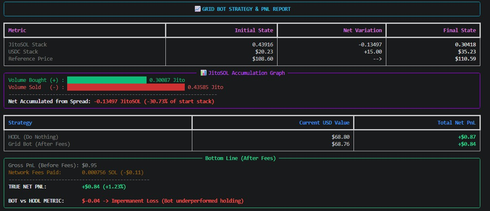
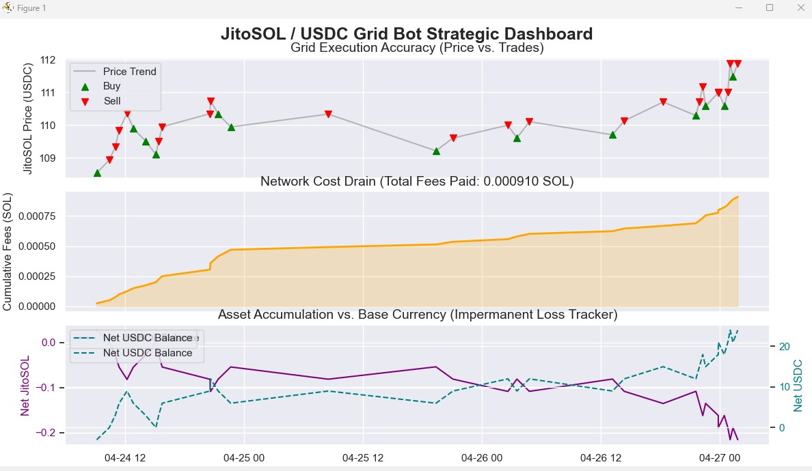

<!DOCTYPE html>
<html lang="en">
<head>
    <meta charset="UTF-8">
    <meta name="viewport" content="width=device-width, initial-scale=1.0">
    <title>AlphaHODL | Bot Analytics</title>
    
</head>
<body>

    <header>
        <h1>⚔️ AlphaHODL Engine</h1>
        
Live Strategy Performance & Analytics

    </header>

    <main class="container">
        
        <section class="markets">
            <h2>Supported Markets</h2>
            
Current and upcoming trading environments for the grid bot.

            
            

                

                    LIVE: Jito Staked SOL (JitoSOL) / USDC
                

                

                    COMING SOON: NVDAx (Tokenized NVIDIA)
                

                

                    COMING SOON: Tokenized Apple Stock (AAPL)
                

            

        </section>

        <section>
            <h2 style="margin-top: 3rem;">Performance Dashboards</h2>
            
            

                

                    
                    

                        <h3 class="card-title">Strategy Execution vs. HODL</h3>
                        
Tracking net accumulated asset spread and impermanent loss metrics over time.

                    

                

                

                    
                    

                        <h3 class="card-title">Timeline & Fee Drain Tracker</h3>
                        
Chronological breakdown of network fee impact and dynamic grid readjustments.

                    

                

            

        </section>

    </main>

</body>
</html>